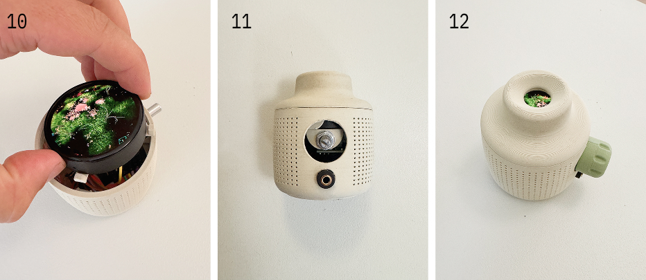

# A mur mur's guide to the galaxy


[mur mur](https://www.murmur.living/) is a small speaker with a world inside.
Not a playlist or a stream, but a living soundscape you can listen to or peek into.

An experiment by [oio](https://oio.studio) and [Mattering](https://matteringstudio.com).

## The DIY version

This guide helps you build the open source hardware prototype of mur mur using readily available off-the-shelf parts. It comes loaded with pre-generated soundscapes for you to enjoy. You can build it with the full feature set (display, battery, charging, and audio) or skip some features for a display-only object.

Questions while building? Join the oio Discord below:

[](https://oio.studio/discord)

#### Steps of this guide:

[1 · Order & print parts](#1-order-and-print-parts)

[2 · Upload code](#2-upload-code)

[3 · Assembly](#3-assembly)

[4 · How to use](#4-how-to-use)

## ❶ Order and print parts

First we need to order a bunch of stuff. The complete bill of materials is right below. The diagram shows you where things go. Filaments are sorted by the type of mur mur and print files need to be printed with the different filaments.


#### BOM

| ID  | Name                                                 | Link                                                                  |
| --- | ---------------------------------------------------- | --------------------------------------------------------------------- |
| M1  | Lens 16mm (20mm FL)                                  | [Amazon](https://www.amazon.nl/dp/B0G3PH9RPP)                         |
| M2  | Display Module (ESP32-S3-Touch-AMOLED-1.75, 466×466) | [Waveshare](https://www.waveshare.com/esp32-s3-touch-amoled-1.75.htm) |
| M3  | Amplifier (PAM8403 with potentiometer)               | [Amazon](https://www.amazon.nl/dp/B09VT68PHX)                         |
| M4  | Speaker 3 watt 4 ohm / 2 watt 8 ohm                  | [Amazon](https://www.amazon.nl/dp/B0DB1WM4QR)                         |
| M5  | DAC (PCM5102A)                                       | [Amazon](https://www.amazon.nl/dp/B0F7LL4S8Z)                         |
| M6  | Headphone jack (3.5 mm extension)                    | [Amazon](https://www.amazon.nl/dp/B0GHQFPSLJ)                         |
| M7  | Battery charger (TP4057 USB-C)                       | [Amazon](https://www.amazon.nl/dp/B0F59VQ8JC)                         |
| M8  | Battery                                              | [Amazon](https://www.amazon.nl/dp/B0F88S2V1Y)                         |
| M9  | M2 screws                                            | Any 4-6mm M2 bolt                                                     |
| M10 | Micro SD                                             | Any MicroSD card (at least 2GB)                                       |
| M11 | Male Pin Header (2.54mm)                             | Any 2.54mm male header                                                |

> **Note:** Most shopping links point to Amazon Netherlands. The same parts (or close equivalents) are widely available across Europe and the US, use the product names and specs here as a search reference, then order from a local seller if that’s easier.

#### Filament

| Color     | Block                                                    | Plot                                                                                   | Pond                                                                             |
| --------- | -------------------------------------------------------- | -------------------------------------------------------------------------------------- | -------------------------------------------------------------------------------- |
| Primary   | [Link](https://www.3djake.nl/esun/pla-matte-light-khaki) | [Link](https://www.3djake.nl/esun/pla-matte-matcha-green)                              | [Link](https://www.3djake.nl/polymaker/polyterra-pla-dual-glacier-blue-ice-blue) |
| Secondary | [Link](https://www.3djake.nl/esun/pla-matte-tangerine)   | [Link](https://www.3djake.nl/polymaker/polyterra-pla-dual-camouflage-dark-green-brown) | [Link](https://www.3djake.nl/formfutura/tough-pla-dark-blue?sai=9932)            |
| Tertiary  | [Link]()                                                 | [Link]()                                                                               | [Link]()                                                                         |

#### 3D print files

Print the four parts below before you assemble. Match filament to your mur mur type (Block, Plot, or Pond) from the table above, primary for the shells, secondary for the dial and mount.

| ID  | Name         | Color     | Link                                                      |
| --- | ------------ | --------- | --------------------------------------------------------- |
| P1  | Top shell    | Primary   | [murmur_top_shell.stl](prints/murmur_top_shell.stl)       |
| P2  | Bottom shell | Primary   | [murmur_buttom_shell.stl](prints/murmur_buttom_shell.stl) |
| P4  | Mount        | Secondary | [murmur_mount.stl](prints/murmur_mount.stl)               |

Use supports on the shells (especially overhangs around the openings), and print one part at a time for cleaner surfaces. The mount (P4) holds the display and speaker. Once the parts are printed and the electronics ordered, flash the firmware, then come back here for wiring and assembly.

## ❷ Upload code

Plug in the board via USB-C. One-time setup:

```bash
brew install arduino-cli
arduino-cli core update-index && arduino-cli core install esp32:esp32
arduino-cli lib install JPEGDEC
arduino-cli lib install "GFX Library for Arduino"
```

Flash the firmware:

```bash
cd firmware && ./flash.sh
```

Hold **BOOT** while plugging in USB if the port does not appear. See `[firmware/README.md](firmware/README.md)` for details.

Put your `.avi` files on a FAT32 microSD card (root), insert it, then power on. The video loops on the round 466×466 AMOLED.

> **Battery:** the 1.75 module has onboard AXP2101 charging (MX1.25 battery header). The separate TP4057 charger (M8) is optional if you prefer an external charge board.

## ❸ Assembly

For the assembly you need just a few things:

- 3D printer
- Computer
- Soldering iron
- Wire stripper
- Screwdriver (for M2 screws)
- Double-sided tape

First step is to wire up all the components. Follow the schematic diagram to solder or connect all wires in the right ways. We used male headers and female jumper wires on some parts to make it easier.


The diagram above is the pin-level wiring map. From the ESP32 header: **GPIO18 → BCK**, **GPIO17 → DIN**, **GPIO16 → LCK** on the PCM5102A, with **3V3 → VIN** and **GND → GND** (also tie the **SCK** to GND). Power runs through the TP4057 to the battery and into the board’s BAT connector.

Power the wired stack and confirm video and audio before you close anything up. When that works, put the parts together in the shell.

#### Putting the parts together


1. Add an 8-pin male header to the ESP pinout. Then solder some female jumper cables to GPIO18, 17, 16, 3V3, and GND and connect them to the PCM5102A. Make sure to wire the SCK to GND. See photo as an example.
2. Wire up the audio output from the PCM5102A to the audio input on the PAM8403 and connect power. Important: the (+) positive wire needs to come directly from the battery or TP4057.
3. Insert and fasten the PAM8403 to the 3D-printed mounting plate.


4. You should have everything wired up, and it should look something like this. Now is a good time to test the screen and audio. Insert the SD card with the media files and flash the firmware.
5. Insert the battery at the bottom with some double-sided tape, and insert the TP4057 into its dedicated slot.
6. Insert the audio jack cable, doubling as the battery locking system.


7. From here on, we will attempt to fit in all the electronics (this may get tight, depending on the amount of wires and thicknesses). Carefully place the PCM5102A on or next to the battery.
8. It can help to snap off the speaker tabs.
9. Everything should fit inside, leaving clearance above the 3 mounting studs.



10. Insert the display by aligning the mounting pins to the mounting studs.
11. Screw on the top shell with the lens installed. Make sure to rotate the top until the inner opening is revealed (see photo). You may need to clean the 3D-printed edge for a good fit. When fully installed, this will lock the mount and display firmly in place.
12. Plug in the 3D-printed dial, and you should be done. 

## ❹ How to use

Make sure a microSD card with your generated media files (e.g., `city.avi`, `forrest.avi`, `water.avi`) on the root is inserted, then power on. The video loops on the round display with sound through the speaker or headphone jack. Give the device a solid shake to switch between themes!

| Control       | Action                                                                                                                                                                                         |
| ------------- | ---------------------------------------------------------------------------------------------------------------------------------------------------------------------------------------------- |
| Shake         | **Switch Theme** — changes the current theme (e.g. from city to forest to water).                                                                                                              |
| Turn On / Off | **Option 1:** Plug in the charging cable at the bottom.<br>**Option 2:** Insert a needle or wire in the top right 2nd hole.<br>**Option 3:** Unscrew the top shell and click the button manually.|

---

Stuck on wiring, flashing, or assembly? Hop into the [oio Discord](https://oio.studio/discord) and ask, we are happy to help.

[](https://oio.studio/discord)
