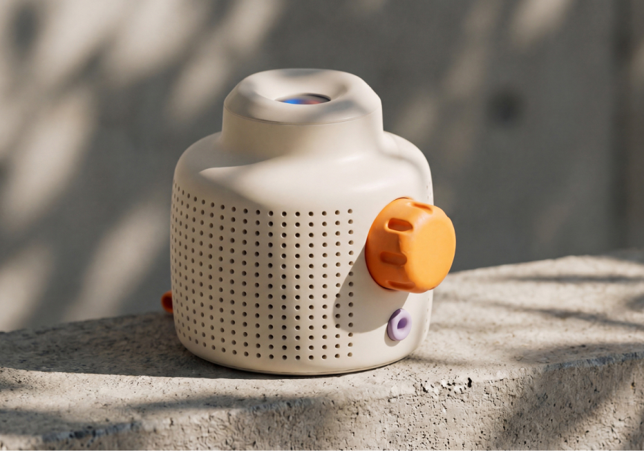
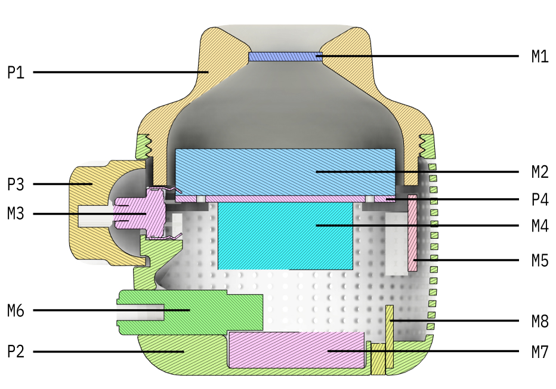
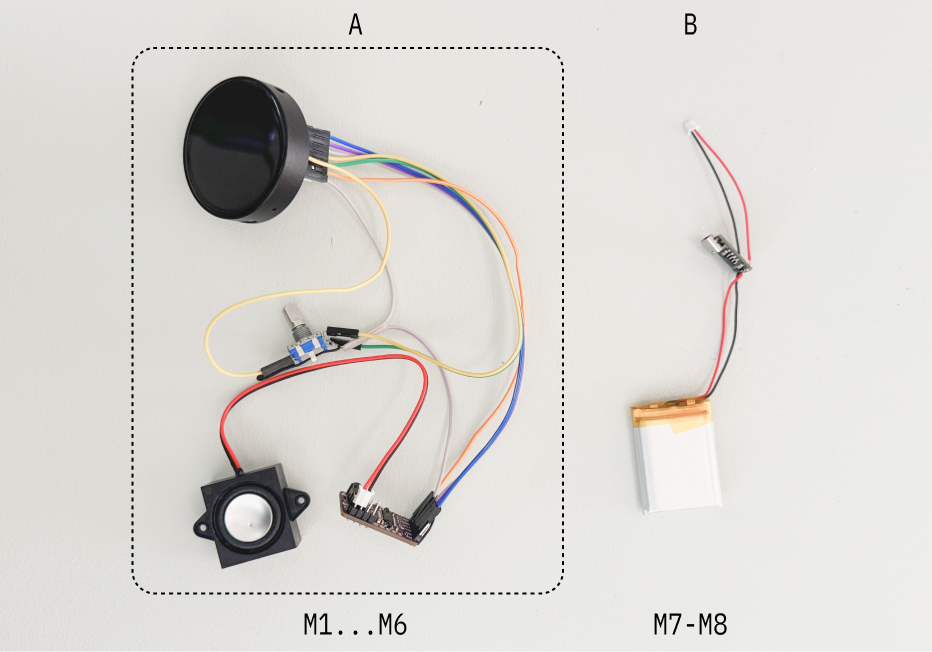
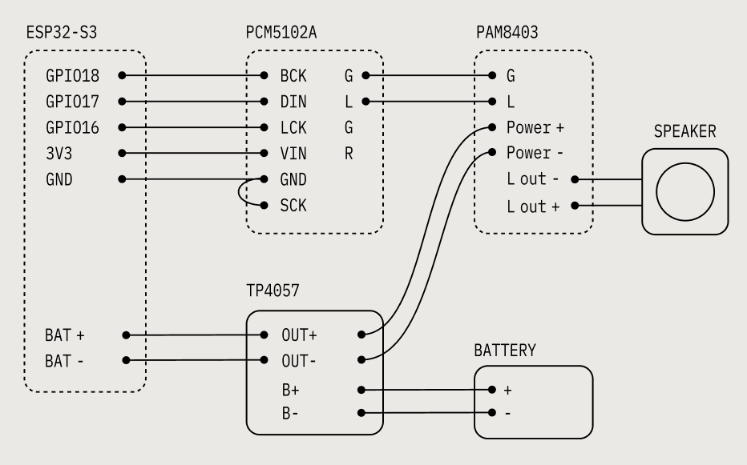
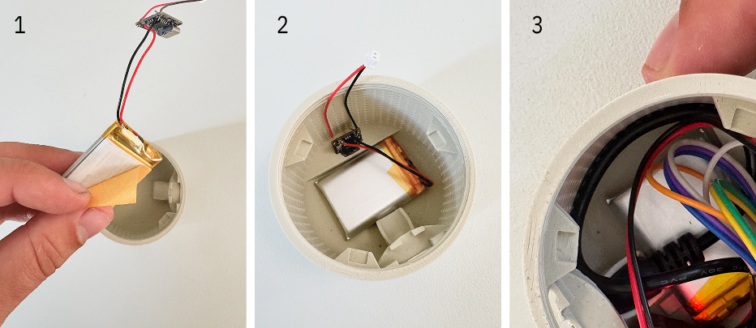
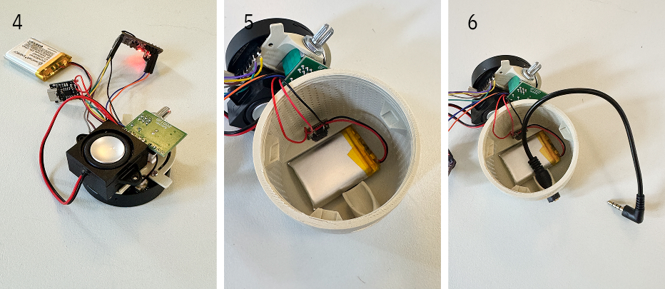
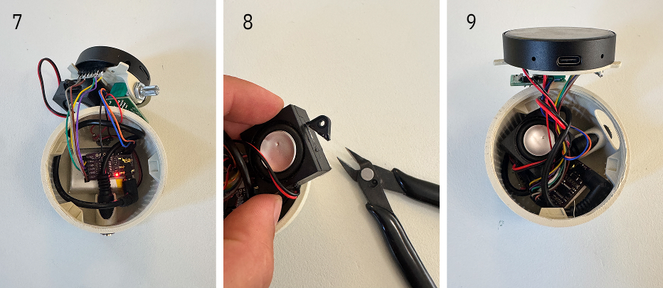

# A murmur's guide to the galaxy



[murmur.living](https://www.murmur.living/), a speaker with a world inside.

Mur mur is an experiment by [oio.studio](https://oio.studio) and [Mattering](https://matteringstudio.com): a small speaker that holds a tiny world, a place with its own weather, rhythms, and society, and plays the ambient sound that world makes. Not a playlist or a stream, but a living soundscape you can sit with, or peek into.

This guide helps you build the open source hardware prototype of Mur mur using readily available off-the-shelf parts. It comes loaded with pre-generated soundscapes for you to enjoy. You can build it with the full feature set (display, battery, charging, audio, and volume control) or skip some features for a display-only object.

Questions while building? Join the oio Discord and ask there:

[Join the oio Discord](https://discord.gg/unRp8D7RC)

#### Steps of this guide:

[1 · Order & print parts](#1-order-and-print-parts)

[2 · Upload code](#2-upload-code)

[3 · Assembly](#3-assembly)

[4 · How to use](#4-how-to-use)

## ❶ Order and print parts

First we need to order a bunch of stuff. The complete Bill of materials is right below. The diagram shows you where things go. Filaments are sorted by the type of murmur and print files need to be printed with the different filaments.



#### BOM


| ID  | Name                                                 | Link                                                                  |
| --- | ---------------------------------------------------- | --------------------------------------------------------------------- |
| M1  | Lens                                                 | [Amazon](https://www.amazon.nl/dp/B0G3PH9RPP)                         |
| M2  | Display Module (ESP32-S3-Touch-AMOLED-1.75, 466×466) | [Waveshare](https://www.waveshare.com/esp32-s3-touch-amoled-1.75.htm) |
| M3  | Rotary encoder (EC11)                                | [Amazon](https://www.amazon.nl/dp/B07RK386GS)                         |
| M4  | Speaker                                              | [Amazon](https://www.amazon.nl/dp/B0DB1WM4QR)                         |
| M5  | DAC (PCM5102A)                                       | [Amazon](https://www.amazon.nl/dp/B0F7LL4S8Z)                         |
| M6  | Headphone jack (3.5 mm extension)                    | [Amazon](https://www.amazon.nl/dp/B0GHQFPSLJ)                         |
| M7  | Battery                                              | [Amazon](https://www.amazon.nl/dp/B0F88S2V1Y)                         |
| M8  | Battery charger (TP4057 USB-C)                       | [Amazon](https://www.amazon.nl/dp/B0F59VQ8JC)                         |
| M9  | M2 screws                                            | Any flat head M2                                                      |
| M10 | Micro SD                                             | Any MicroSD card                                                      |


> **Note:** Most shopping links point to Amazon Netherlands for convenience. The same parts (or close equivalents) are widely available across Europe and the US, use the product names and specs here as a search reference, then order from a local seller if that’s easier.

#### Filament


| Color     | Block                                                    | Plot                                                                                   | Pond                                                                             |
| --------- | -------------------------------------------------------- | -------------------------------------------------------------------------------------- | -------------------------------------------------------------------------------- |
| Primary   | [Link](https://www.3djake.nl/esun/pla-matte-light-khaki) | [Link](https://www.3djake.nl/esun/pla-matte-matcha-green)                              | [Link](https://www.3djake.nl/polymaker/polyterra-pla-dual-glacier-blue-ice-blue) |
| Secondary | [Link](https://www.3djake.nl/esun/pla-matte-tangerine)   | [Link](https://www.3djake.nl/polymaker/polyterra-pla-dual-camouflage-dark-green-brown) | [Link](https://www.3djake.nl/formfutura/tough-pla-dark-blue?sai=9932)            |
| Tertiary  | [Linka]()                                                | [Linkb]()                                                                              | [Linkc]()                                                                        |


#### 3D print files

Print the four parts below before you assemble. Match filament to your murmur type (Block, Plot, or Pond) from the table above, primary for the shells, secondary for the dial and mount.


| ID  | Name         | Color     | Link                                                      |
| --- | ------------ | --------- | --------------------------------------------------------- |
| P1  | Top shell    | Primary   | [murmur_top_shell.stl](prints/murmur_top_shell.stl)       |
| P2  | Bottom shell | Primary   | [murmur_buttom_shell.stl](prints/murmur_buttom_shell.stl) |
| P3  | Dial         | Secondary | [murmur_dial.stl](prints/murmur_dial.stl)                 |
| P4  | Mount        | Secondary | [murmur_mount.stl](prints/murmur_mount.stl)               |


Use supports on the shells (especially overhangs around the openings), and print one part at a time for cleaner surfaces. The mount (P4) holds the display and speaker; the dial (P3) presses onto the encoder shaft after the top shell is screwed on. Once the parts are printed and the electronics ordered, flash the firmware, then come back here for wiring and assembly.

## ❷ Upload code

Plug in the board via USB-C. One-time setup:

```bash
brew install arduino-cli
arduino-cli core update-index && arduino-cli core install esp32:esp32
arduino-cli lib install JPEGDEC
arduino-cli lib install "GFX Library for Arduino"
```

Flash the firmware:

```bash
cd firmware && ./flash.sh
```

Hold **BOOT** while plugging in USB if the port does not appear. See `[firmware/README.md](firmware/README.md)` for details.

Put `video.avi` on a FAT32 microSD card (root), insert it, then power on, the video loops on the round 466×466 AMOLED.

> **Battery:** the 1.75 module has onboard AXP2101 charging (MX1.25 battery header). The separate TP4057 charger (M8) is optional if you prefer an external charge board.

## ❸ Assembly

For the assembly you need just a few things:

- 3D printer
- Computer
- Soldering iron
- Wire stripper
- Screwdriver (for M2 screws)
- Double-sided tape

First step is to wire up all the components. Follow the schematic diagram to solder or connect all wires in the right order. Start with cluster (A) as this is the most critical part and worth testing before doing any assembly. For easy connection we used female headers with male pin headers, but this makes the wiring take up a lot of space and makes the assembly harder. We recommend soldering small wires to male headers directly.





The diagram above is the pin-level wiring map. From the ESP32 header: **GPIO18 → BCK**, **GPIO17 → DIN**, **GPIO16 → LCK** on the PCM5102A, with **3V3 → VIN** and **GND → GND** (also tie the DAC **SCK** to GND). The encoder uses **TX → CLK/A**, **RX → DT/B**, **EX0 → SW**, and shared GND. Power runs through the TP4057 to the battery and into the board’s BAT connector.

Power the wired stack and confirm video and audio before you close anything up. When that works, put the parts together in the shell.

#### Putting the parts together



1. Add double-sided tape on the battery.
2. Stick in the button.
3. Lock it by sliding in the headphone jack (extension cable) over it.



1. Use M2 screws to attach the mount (P4) to the display. Add double-sided tape to the speaker or use screws and attach it to the dedicated holes (careful that they are not too long).
2. Attach the speaker to the mount.
3. Plug the battery connector into the screen and place the encoder in its slot.



1. Carefully place the DAC (M5) and other cables in the corner of the shell.
2. Insert the screen using the mount guiding pins.
3. Screw the top shell on, locking the screen and encoder in place. Lastly, place the dial (P3) on the encoder.

## ❹ How to use

Make sure a microSD card with `video.avi` on the root is inserted, then power on with the board’s **PWR** button. The video loops on the round display with sound through the speaker or headphone jack.


| Control | Action |
| --- | --- |
| Turn the dial | Volume up / down (shown briefly on screen) |
| Hold the dial ~1 s | **Pause / Standby** — screen off, audio muted. Battery will drain in a few hours because the processor stays awake waiting for your next click. |
| Click the dial | Wake from standby and resume playback |
| Board **PWR** button | **True Power Off** — physically cuts battery power. Use this when turning the device off for the day. (Note: Because power is cut, you cannot use the dial to turn it back on; you must press the PWR button). |


---

Stuck on wiring, flashing, or assembly? Hop into the [oio Discord](https://discord.gg/unRp8D7RC) and ask, happy to help.

[Join the oio Discord](https://discord.gg/unRp8D7RC)